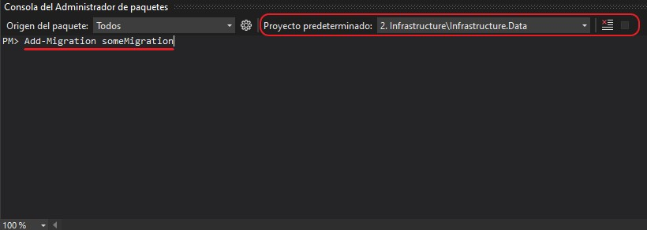

# ApiService
This is the main application backend service that provide the API endpoints.

## Database Migrations

### To adds migration from `Package Manager Console` of Visual Studio
  
1. Make sure that **`ApiService`** is set as the `Startup Project` of the solution

  

2. Make sure that **`Infrastructure.Data`** is set as `Default Project` in Package Manager Console
3. Write this on the console:
  
  `Add-Migration <NAME OF MIGRATION>`

  

4. Then to impact in database:

  `Update-Database`

### To adds migration from `.NET Core CLI`

1. From `Developer Command Prompt for VS` or `VSCode Terminal` or some other command line terminal of your system, make sure to go to **`src`** sub-folder of repo.

2. Write this command:
  
  ```
  dotnet ef migrations add <NAME OF MIGRATION>
    --startup-project ApiService/ApiService.csproj
    --project Infrastructure.Data/Infrastructure.Data.csproj
  ```

3. Then to impact in database, write this:

  ```
  dotnet ef database update
    --startup-project ApiService/ApiService.csproj
    --project Infrastructure.Data/Infrastructure.Data.csproj
  ```

[**`Back to README.md`**](../README.md)