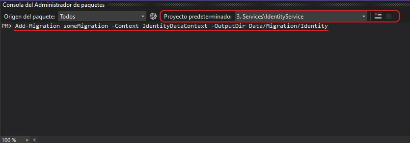

# IdentityService

This is a monolithic Identity Service implemented with [Duende IdentityServer](https://duendesoftware.com/products/identityserver).

* The purpose of this service is to be:
    * The Authentication and Authorization server.
    * The AccessToken provider.
    * The common user identity, claims and roles storage service.

## Database Migrations

### To adds migration from `Package Manager Console` of Visual Studio
  
1. Make sure that **`IdentityService`** is set as the `Startup Project` of the solution

  

2. Make sure that **`IdentityService`** is set as `Default Project` in Package Manager Console
3. Write this on the console:
  
  ```
  Add-Migration <NAME OF MIGRATION> 
    -Context { ConfigurationDbContext | PersistedGrantDbContext | IdentityDataContext }
    -OutputDir Data/Migration/{ Configuration | Operational | Identity }
  ```

  

4. Then to impact in database:

  `Update-Database -Context { ConfigurationDbContext | PersistedGrantDbContext | IdentityDataContext }`

### To adds migration from `.NET Core CLI`

1. From `Developer Command Prompt for VS` or `VSCode Terminal` or some other command line terminal of your system, make sure to go to **`src/IdentityService`** sub-folder of repo.

2. Write this command:
  
  ```
  dotnet ef migrations add <NAME OF MIGRATION>
    --startup-project IdentityService.csproj
    --project IdentityService.csproj
    --context { ConfigurationDbContext | PersistedGrantDbContext | IdentityDataContext }
    --output-dir Data/Migration/{ Configuration | Operational | Identity }
  ```

3. Then to impact in database, write this:

  ```
  dotnet ef database update
    --startup-project IdentityService.csproj
    --project IdentityService.csproj
    --context { ConfigurationDbContext | PersistedGrantDbContext | IdentityDataContext }
  ```

[**`Back to README.md`**](../README.md)